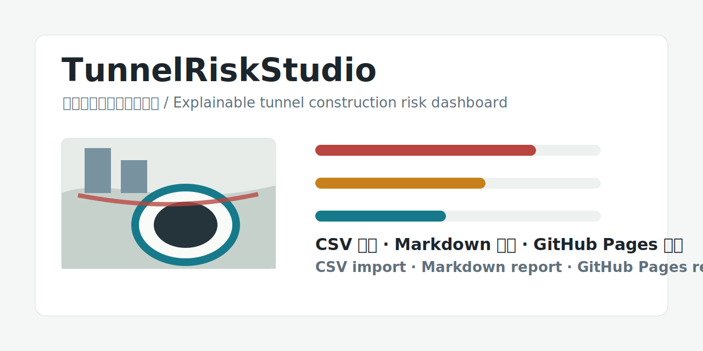

# TunnelRiskStudio

[](LICENSE)
[](.github/workflows/static-check.yml)
[](docs/publish.md)
[](index.html)

面向土木、建筑、隧道工程的原创开源项目：用一个无需后端的 Web 研判台，把隧道施工监测、围岩条件、支护时序、邻近建筑物保护和施工参数放在同一套可解释风险评分模型里。  
An original open-source project for civil, building, and tunnel engineering: a backend-free Web studio that combines tunnel monitoring, ground conditions, support timing, nearby building protection, and construction parameters into one explainable risk scoring model.



## 为什么值得 Star / Why Star This Project

- **工程主题明确 / Focused engineering topic**：聚焦隧道施工风险，而不是泛泛的数据仪表盘。 / It focuses on tunnel construction risk instead of a generic dashboard.
- **能直接运行 / Runs directly**：打开 `index.html` 即可演示，无需安装依赖。 / Open `index.html` and run it without installing dependencies.
- **可解释 / Explainable**：每个风险分数都能追溯到沉降、收敛、水位、支护滞后等主控因素。 / Every score can be traced back to settlement, convergence, groundwater, support lag, and other drivers.
- **可扩展 / Extensible**：预留 BIM/IFC、监测 CSV、地质资料、有限元结果和报告导出方向。 / It leaves room for BIM/IFC, monitoring CSV, geology data, FEM results, and report export.
- **适合展示 / Demo-ready**：README、Demo 脚本、样例数据、Issue 模板、CI 检查都已经准备好。 / README, demo script, sample data, issue templates, and CI checks are included.

> 当前版本是一个可直接运行的原型，不复制第三方项目代码。它参考了若干开源工程工具的技术方向，并在此基础上重组为“隧道施工风险智能研判台”。  
> This version is a runnable prototype. It does not copy third-party project code; it studies open-source engineering tools and redesigns the workflow as a tunnel construction risk intelligence studio.

## 快速开始 / Quick Start

1. 下载或克隆本项目。 / Download or clone this project.
2. 用浏览器打开 `index.html`。 / Open `index.html` in a browser.
3. 切换场景或拖动参数，查看风险分数、主控因素、剖面联动图和处置建议。 / Switch scenarios or move sliders to view the risk score, key drivers, section view, and recommendations.
4. 导入 `data/monitoring-sample.csv`，体验监测数据更新风险状态。 / Import `data/monitoring-sample.csv` to update the risk state from monitoring data.
5. 点击 `导出报告 / Report` 或 `导出 JSON / JSON`，生成工程研判资料。 / Click `Report` or `JSON` to export engineering records.

如果发布到 GitHub Pages，可将 Pages 来源设置为 `main` 分支的根目录，入口文件就是 `index.html`。  
For GitHub Pages, set the source to the root of the `main` branch. The entry file is `index.html`.

## 演示流程 / Demo Flow

1. 打开首页，说明项目目标：把隧道、围岩、建筑物、监测和施工参数放在一起研判。 / Open the page and explain the goal: tunnel, ground, buildings, monitoring, and construction parameters in one view.
2. 切换到 `山岭隧道断层破碎带 / Mountain tunnel fault fracture zone`。 / Switch to the mountain tunnel fault scenario.
3. 调高 `地下水位变化 / Groundwater Change` 或 `支护滞后 / Support Lag`。 / Increase groundwater change or support lag.
4. 展示综合风险、主控因素排序和处置建议如何变化。 / Show how risk score, driver ranking, and recommendations change.
5. 导入 `data/monitoring-sample.csv`。 / Import the sample CSV.
6. 导出 Markdown 风险报告。 / Export the Markdown risk report.

完整演示稿见 [docs/demo-script.md](docs/demo-script.md)。  
See [docs/demo-script.md](docs/demo-script.md) for the full demo script.

## 功能 / Features

| 模块 / Module | 说明 / Description |
| --- | --- |
| 场景管理 / Scenario management | 内置城市地铁软土、山岭隧道断层破碎带、明挖车站邻近建筑 3 类样例。 / Includes three example scenarios: urban soft-ground metro, mountain tunnel fault zone, and cut-and-cover station near buildings. |
| 风险输入 / Risk inputs | 支持施工方法、围岩等级、沉降、收敛、水位、支护滞后等参数。 / Supports method, ground class, settlement, convergence, groundwater, support lag, and more. |
| CSV 导入 / CSV import | 支持以 `metric,value,unit` 为核心字段的监测 CSV 样例。 / Supports monitoring CSV with `metric,value,unit` fields. |
| 风险引擎 / Risk engine | 按施工方法配置权重，按围岩等级修正综合风险。 / Uses method-specific weights and ground-class multipliers. |
| 主控因素 / Key drivers | 自动排序风险贡献，识别最需要工程处理的因素。 / Ranks factor contributions and identifies the most important drivers. |
| 处置建议 / Recommendations | 根据分数和主控因素生成现场响应建议。 / Generates site response suggestions from score and key drivers. |
| 剖面可视化 / Section visualization | 动态绘制隧道结构、建筑物、地表沉降和拱顶沉降。 / Draws tunnel structure, buildings, surface settlement, and crown settlement. |
| 报告导出 / Report export | 导出 Markdown 风险报告和 JSON 快照。 / Exports Markdown reports and JSON snapshots. |
| GitHub 支持 / GitHub-ready | 内置 Issue 模板、PR 模板、CI 静态检查、发布说明。 / Includes issue templates, PR template, CI static check, and publishing notes. |

## 风险模型 / Risk Model

当前版本采用轻量化、可解释的加权评分模型：  
The current version uses a lightweight and explainable weighted scoring model:

```text
单因子风险 / Factor risk = normalize(工程指标 / engineering metric)
方法权重 / Method weight = weightsByMethod[施工方法 / method][指标 / metric]
围岩修正 / Ground multiplier = groundMultiplier[围岩等级 / ground class]
综合风险 / Overall risk = sum(单因子风险 * 方法权重) * 围岩修正
```

| 分数 / Score | 等级 / Level | 建议响应 / Response |
| --- | --- | --- |
| 0-34 | 低风险 / Low Risk | A：常规巡视 / Routine inspection |
| 35-54 | 中风险 / Medium Risk | B：重点巡视 / Focused inspection and trend tracking |
| 55-74 | 高风险 / High Risk | C：加密监测 / Increase monitoring and review parameters |
| 75-100 | 极高风险 / Critical Risk | D：停工核查 / Stop-and-review or special response |

> 注意：本模型用于项目原型、教学展示和方案研究，不应直接替代正式设计、监测预警标准或专家评审。  
> Note: this model is for prototyping, teaching, and concept studies. It must not replace formal design, monitoring standards, or expert review.

## CSV 格式 / CSV Format

示例文件 / Sample file: [data/monitoring-sample.csv](data/monitoring-sample.csv)

```csv
timestamp,chainage,metric,value,unit,source
2026-06-05T08:00:00+08:00,K12+380,crownSettlement,30,mm,total-station
2026-06-05T08:00:00+08:00,K12+380,surfaceSettlement,38,mm,leveling
```

| metric | 中文指标 / Chinese metric | Unit |
| --- | --- | --- |
| `crownSettlement` | 拱顶沉降 / Crown settlement | mm |
| `convergence` | 周边收敛 / Convergence | mm |
| `surfaceSettlement` | 地表沉降 / Surface settlement | mm |
| `waterChange` | 地下水位变化 / Groundwater change | m |
| `supportLag` | 支护滞后 / Support lag | m |
| `buildingDistance` | 建筑物距离 / Building distance | m |
| `advanceRate` | 掘进速度 / Advance rate | m/d |
| `facePressureDelta` | 掌子面压力偏差 / Face pressure deviation | kPa |

## 项目结构 / Project Structure

```text
TunnelRiskStudio/
├── .github/
│   ├── ISSUE_TEMPLATE/
│   ├── PULL_REQUEST_TEMPLATE.md
│   └── workflows/static-check.yml
├── assets/
│   └── social-preview.svg
├── data/
│   ├── monitoring-sample.csv
│   └── scenarios.json
├── docs/
│   ├── architecture.md
│   ├── demo-script.md
│   ├── publish.md
│   ├── research.md
│   └── star-growth.md
├── src/
│   ├── app.js
│   └── styles.css
├── CHANGELOG.md
├── CITATION.cff
├── CODE_OF_CONDUCT.md
├── CONTRIBUTING.md
├── LICENSE
├── SECURITY.md
└── README.md
```

## 开源启发 / Open-source Inspiration

本项目参考了以下开源方向，但未复制其代码：  
This project studies the following open-source directions, but does not copy their code:

| 项目 / Project | 方向 / Direction | 启发 / Inspiration |
| --- | --- | --- |
| [IfcOpenShell](https://github.com/IfcOpenShell/IfcOpenShell) | IFC/BIM 解析、几何和模型数据生态 / IFC/BIM parsing, geometry, and model data ecosystem | 未来接入 BIM 构件、衬砌环片、邻近建筑资产。 / Connect BIM components, lining segments, and nearby building assets. |
| [PyNite](https://github.com/JWock82/Pynite) | 结构有限元和位移/内力分析 / Structural FEM and displacement/force analysis | 输出可解释工程指标。 / Produce explainable engineering indicators. |
| [pyGIMLi](https://github.com/gimli-org/pyGIMLi) | 地球物理建模与反演 / Geophysical modeling and inversion | 将地质异常和富水带转化为风险因子。 / Convert geological anomalies and water-rich zones into risk factors. |
| [bedrock-ge](https://github.com/bedrock-engineer/bedrock-ge) | 岩土、AGS、BIM、地下工程数据 / Geotechnical, AGS, BIM, and underground data | 统一整理钻孔、地层、地下资产与工程记录。 / Organize boreholes, strata, underground assets, and records. |
| [openpile](https://github.com/TchilDill/openpile) | 桩基与土体响应建模 / Pile and soil response modeling | 启发支护结构和周边土体的简化响应表达。 / Inspire simplified support-ground response modeling. |
| [GeoEq](https://geoeq.org/) | 岩土公式与单位说明 / Geotechnical formulas and units | 强化指标单位、适用边界和计算透明度。 / Strengthen units, applicability, and calculation transparency. |

第三方项目许可证请以上游仓库为准。本仓库以原创代码发布，使用 MIT License。  
Third-party licenses should be checked in their upstream repositories. This repository publishes original code under the MIT License.

## 路线图 / Roadmap

- [x] 静态风险研判台 / Static risk assessment studio
- [x] 场景化风险输入 / Scenario-based risk inputs
- [x] 风险贡献解释 / Risk contribution explanation
- [x] JSON 快照导出 / JSON snapshot export
- [x] CSV 监测数据导入 / Monitoring CSV import
- [x] Markdown 风险报告导出 / Markdown risk report export
- [ ] 监测时序曲线 / Monitoring time-series charts
- [ ] BIM/IFC 构件映射示例 / BIM/IFC asset mapping example
- [ ] 地质资料和钻孔数据融合 / Geology and borehole data fusion
- [ ] 规范化阈值库 / Standardized threshold library
- [ ] PDF/Word 报告导出 / PDF/Word report export
- [ ] GitHub Pages 在线演示 / GitHub Pages live demo

## 获取更多 Star / Getting More Stars

发布后建议设置仓库描述、Topics 和首个 Release。详细清单见 [docs/star-growth.md](docs/star-growth.md)。  
After publishing, set the repository description, topics, and first release. See [docs/star-growth.md](docs/star-growth.md) for the checklist.

## 发布到 GitHub / Publish to GitHub

如果本地已有 Git 和 GitHub CLI：  
If Git and GitHub CLI are installed locally:

```powershell
cd F:\TunnelRiskStudio
.\scripts\publish-github.ps1
```

也可以手动执行：  
Or run the commands manually:

```powershell
cd F:\TunnelRiskStudio
git init
git branch -M main
git add .
git commit -m "Initial release of TunnelRiskStudio"
gh repo create TunnelRiskStudio --public --source . --remote origin --push
```

启用 GitHub Pages：  
Enable GitHub Pages:

1. 打开仓库 `Settings`。 / Open repository `Settings`.
2. 进入 `Pages`。 / Go to `Pages`.
3. Source 选择 `Deploy from a branch`。 / Set Source to `Deploy from a branch`.
4. Branch 选择 `main` 和 `/root`。 / Select `main` and `/root`.
5. 保存后等待 GitHub 生成访问地址。 / Save and wait for GitHub to generate the URL.

更多细节见 [docs/publish.md](docs/publish.md)。  
See [docs/publish.md](docs/publish.md) for more details.

## 免责声明 / Disclaimer

本项目不是正式工程设计软件，也不是监测预警系统成品。所有阈值、权重和处置建议均为原型示例，实际工程必须由具备资质的专业人员结合规范、监测合同、设计文件和现场情况进行校核。  
This project is not certified engineering design software or a finished monitoring warning system. All thresholds, weights, and recommendations are prototype examples and must be reviewed by qualified professionals against standards, monitoring contracts, design documents, and site conditions.

## 许可证 / License

MIT License. See [LICENSE](LICENSE).
