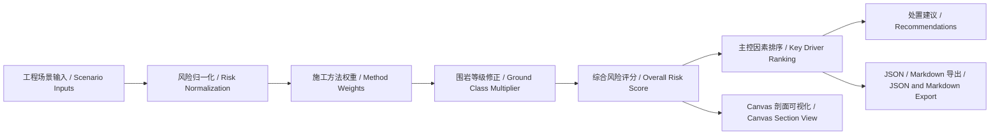

# 技术架构 / Technical Architecture

TunnelRiskStudio 采用静态 Web 架构，便于在 GitHub Pages、内网静态服务器或本地浏览器直接运行。  
TunnelRiskStudio uses a static Web architecture, so it can run on GitHub Pages, an internal static server, or a local browser.

## 架构图 / Architecture Diagram

## 前端模块 / Frontend Modules

| 文件 / File | 职责 / Responsibility |
| --- | --- |
| `index.html` | 页面结构、输入控件、结果区域。 / Page structure, input controls, and result areas. |
| `src/styles.css` | 响应式布局、风险状态、工程仪表盘视觉。 / Responsive layout, risk states, and engineering dashboard styling. |
| `src/app.js` | 样例场景、风险模型、Canvas 绘图、CSV 导入、报告导出。 / Sample scenarios, risk model, Canvas drawing, CSV import, and report export. |
| `data/scenarios.json` | 场景数据示例，便于后续替换成真实工程数据。 / Scenario data examples that can later be replaced by real project data. |
| `data/monitoring-sample.csv` | 监测数据导入示例。 / Sample monitoring data for CSV import. |

## 风险计算流程 / Risk Calculation Flow

1. 读取当前场景参数。 / Read current scenario parameters.
2. 对每个指标做 0-100 归一化。 / Normalize each metric to 0-100.
3. 根据施工方法选择权重。 / Select weights by construction method.
4. 根据围岩等级乘以修正系数。 / Apply the ground class multiplier.
5. 计算综合分数并映射风险等级。 / Calculate the overall score and map it to a risk level.
6. 按加权贡献排序，识别主控因素。 / Rank factors by weighted contribution to identify key drivers.
7. 根据分数和主控因素生成处置建议。 / Generate recommendations from score and drivers.
8. 支持导入监测 CSV 并导出 Markdown/JSON 研判资料。 / Support monitoring CSV import and Markdown/JSON export.

## 指标说明 / Metric Notes

| 指标 / Metric | 单位 / Unit | 风险含义 / Risk Meaning |
| --- | --- | --- |
| 拱顶沉降 / Crown settlement | mm | 反映开挖后围岩和初支竖向变形。 / Indicates vertical deformation of surrounding ground and primary support. |
| 周边收敛 / Convergence | mm | 反映洞周变形和支护受力状态。 / Indicates tunnel perimeter deformation and support loading. |
| 地表沉降 / Surface settlement | mm | 反映对道路、管线和建筑物的影响。 / Indicates impact on roads, utilities, and buildings. |
| 地下水位变化 / Groundwater change | m | 反映降水、突涌水或渗流扰动。 / Indicates dewatering, inrush, or seepage disturbance. |
| 支护滞后 / Support lag | m | 反映开挖与初支闭合之间的风险窗口。 / Indicates the risk window between excavation and support closure. |
| 建筑物距离 / Building distance | m | 距离越近，保护对象风险越高。 / The closer the building, the higher the protected-asset risk. |
| 掘进速度 / Advance rate | m/d | 过快可能放大未闭合支护和参数偏差风险。 / Excessive rate may amplify support timing and parameter risks. |
| 掌子面压力偏差 / Face pressure deviation | kPa | 盾构/TBM 或开挖面稳定控制指标。 / Control metric for shield/TBM or excavation face stability. |

## 后续数据接口设计 / Future Data Interfaces

- `monitoring.csv`：时间、测点、指标、数值、单位、阈值。 / Time, point, metric, value, unit, and threshold.
- `alignment.geojson`：线路中心线、里程、风险区段。 / Alignment centerline, chainage, and risk sections.
- `assets.ifc`：建筑物、管线、隧道构件和支护结构。 / Buildings, utilities, tunnel components, and support structures.
- `geology.json`：地层、断层、富水段、岩性和地勘说明。 / Strata, faults, water-rich zones, lithology, and geotechnical notes.
- `fem-results.json`：有限元计算位移、内力、塑性区或安全系数。 / FEM displacement, internal force, plastic zone, or safety factor.

## 设计原则 / Design Principles

- 原型优先：先把工程逻辑讲清楚，再逐步接入复杂数据。 / Prototype first: clarify engineering logic before adding complex data.
- 可解释优先：任何风险分数都必须能追溯到指标贡献。 / Explainability first: every score must trace back to metric contributions.
- 零依赖优先：便于 GitHub Pages 发布和课堂演示。 / Zero dependency first: easy for GitHub Pages and classroom demos.
- 授权清晰：不直接复制第三方代码，参考项目只做灵感和路线对照。 / Clear licensing: no copied third-party code; references are for inspiration and route comparison.
